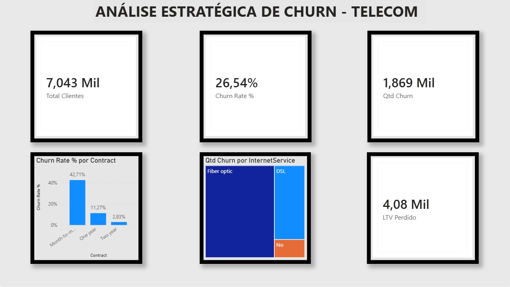

# 📊 Análise de Churn: Retenção de Clientes Telecom

##  Objetivo do Projeto
O objetivo deste projeto é analisar o comportamento de cancelamento (Churn) de uma empresa de telecomunicações. Como Analista de Dados, meu papel aqui é **reduzir a incerteza** da tomada de decisão, identificando os principais gargalos que levam o cliente a abandonar o serviço e propondo ações estratégicas baseadas em dados.

##  Sobre os Dados
O dataset utilizado contém informações de 7.043 clientes e inclui atributos como:
- **Demográficos:** Gênero, idosos, parceiros e dependentes.
- **Serviços:** Telefonia, múltiplas linhas, internet, segurança online, backup, proteção de dispositivo, suporte técnico e streaming.
- **Conta:** Tempo de contrato (tenure), método de pagamento, faturamento sem papel, cobranças mensais e totais.

##  Stack Tecnológica
- **SQL:** Utilizado para limpeza, tratamento e criação de métricas de negócio (CTEs, Window Functions e Agregações).
- **Power BI:** Modelagem de dados seguindo o padrão **Star Schema** e visualização de KPIs.
- **GitHub:** Versionamento de scripts e documentação.

##  O que estou analisando?
1. **Perfil do Churn:** Existe um perfil demográfico mais propenso a sair?
2. **Impacto do Contrato:** Contratos mensais (Month-to-month) retêm menos que os anuais?
3. **Serviços Críticos:** A falta de suporte técnico influencia na taxa de cancelamento?
4. **Impacto Financeiro:** Qual o MRR (Monthly Recurring Revenue) perdido com o churn atual?

---
*Este é um projeto autoral para portfólio, utilizando dados públicos anonimizados.*
